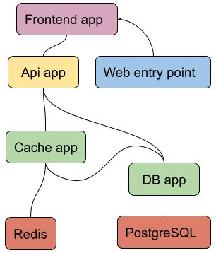
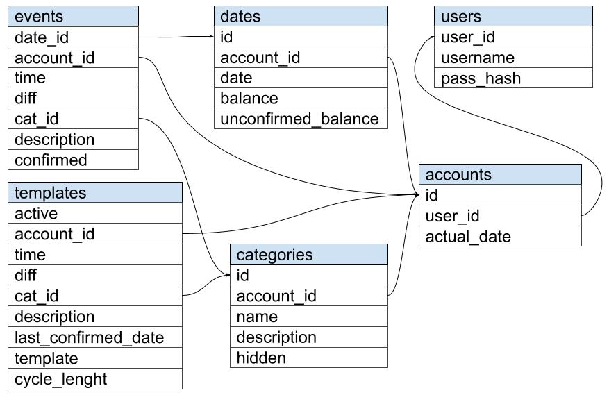

# COIN
Simple budget planner.

## Architecture
* frontend - flutter
* gateway - flask + gunicorn
* backend - nameko microservices + rabbitMQ
* db - postgresql
* cache - redis

All wrapped up in docker containers.

## Database
Data base contains information about users, their accounts and transactions. 

## UI
UI is made with flutter.

## Deployment
* dev deployment - docker-compose. Run `docker-compose build; docker-compose up` to deploy.
* production deployment - kubernetes

All config values must be stored in `config.env` in project root. It must have folowing values:

* RABBITMQ_DEFAULT_USER
* RABBITMQ_DEFAULT_PASS
* RABBITMQ_HOST RABBITMQ_PORT
* SECRET_KEY
* FLASK_ENV
* FLASK_APP
* FLASK_DEBUG
* JWT_SECRET_KEY
* REDIS_PASSWORD
* REDIS_HOST
* REDIS_PORT
* REDIS_INDEX
* REDIS_REPLICATION_MODE
* POSTGRES_USER
* POSTGRES_PASSWORD
* POSTGRES_DB
* POSTGRES_HOST
* POSTGRES_PORT

TODO
* nameko unit tests
* flask unit tests
* flutter tests
* expiration tokens
* handle different token problems
* cookies
* auto-build web app
* fix versions of libs
* run build tests with github actions
* redis password
* pg admin
* redis admin
* rabbit admin
* dev mode
* debug method decorator
* kubernetes
* nginx for hosting web app
* dynamic web dispatching